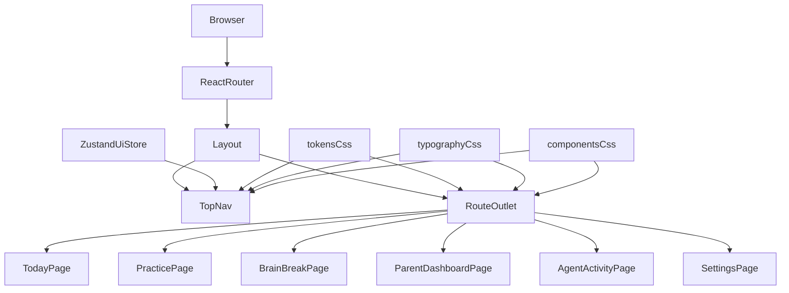

# Data Flow Diagram

```mermaid
flowchart TD
  frontendApp[frontendApp localhost:5173] --> backendApi[backendApi localhost:3001]
  backendApi --> sessionApi[/api/session/*]
  backendApi --> itemsApi[/api/items/*]
  backendApi --> aiApi[/api/ai/*]
  backendApi --> dashboardApi[/api/dashboard/*]
  backendApi --> agentsApi[/api/agents/*]
  backendApi --> exportApi[/api/export/iep-pdf]

  parentDashboard[ParentDashboard] --> studentsTbl[students]
  parentDashboard --> sessionsTbl[sessions]
  sessionsTbl --> attemptsTbl[attempts]
  sessionsTbl --> brainBreaksTbl[brain_breaks]
  studentsTbl --> studentSkillLevelsTbl[student_skill_levels]
  studentsTbl --> itemMasteryTbl[item_mastery]
  skillsTbl[skills] --> itemsTbl[items]
  skillsTbl --> sessionsTbl
  itemsTbl --> itemMasteryTbl
  itemsTbl --> attemptsTbl
  studentsTbl --> weeklyInsightsTbl[weekly_insights]

  agentsTbl[agents] --> agentRunsTbl[agent_runs]
  agentRunsTbl --> agentActionsTbl[agent_actions]
  studentsTbl --> studentTuningTbl[student_tuning]
  agentsTbl --> studentTuningTbl
  agentActionsTbl --> studentTuningTbl
  agentActionsTbl --> sessionsTbl
  agentActionsTbl --> studentSkillLevelsTbl
  sessionApi --> sessionsTbl
  itemsApi --> itemsTbl
  itemsApi --> attemptsTbl
  dashboardApi --> weeklyInsightsTbl
  agentsApi --> agentsTbl
  agentsApi --> agentRunsTbl
  agentsApi --> agentActionsTbl
```

## Notes

- Core learning flow: `students` + `skills` drive session queueing, attempts, and item mastery updates.
- Agent flow: `agents` create `agent_runs`, write `agent_actions`, and adjust `student_tuning` that influences future sessions.
- Weekly summaries are persisted in `weekly_insights` for parent review and IEP reporting.
- API layer now exposes stubbed route groups for session, items, AI, dashboard, agents, and export flows.

## Frontend Route Shell (Design System Foundation)


