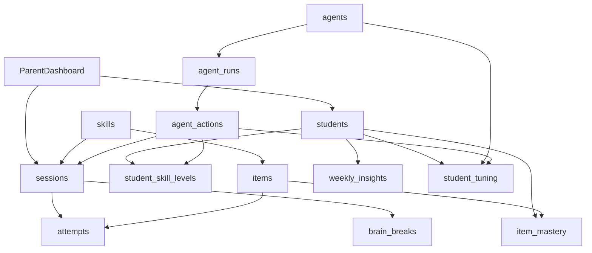

# Data Flow Diagram

## Notes

- Core learning flow: `students` + `skills` drive session queueing, attempts, and item mastery updates.
- Agent flow: `agents` create `agent_runs`, write `agent_actions`, and adjust `student_tuning` that influences future sessions.
- Weekly summaries are persisted in `weekly_insights` for parent review and IEP reporting.
