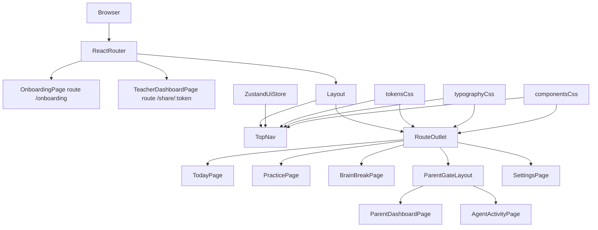
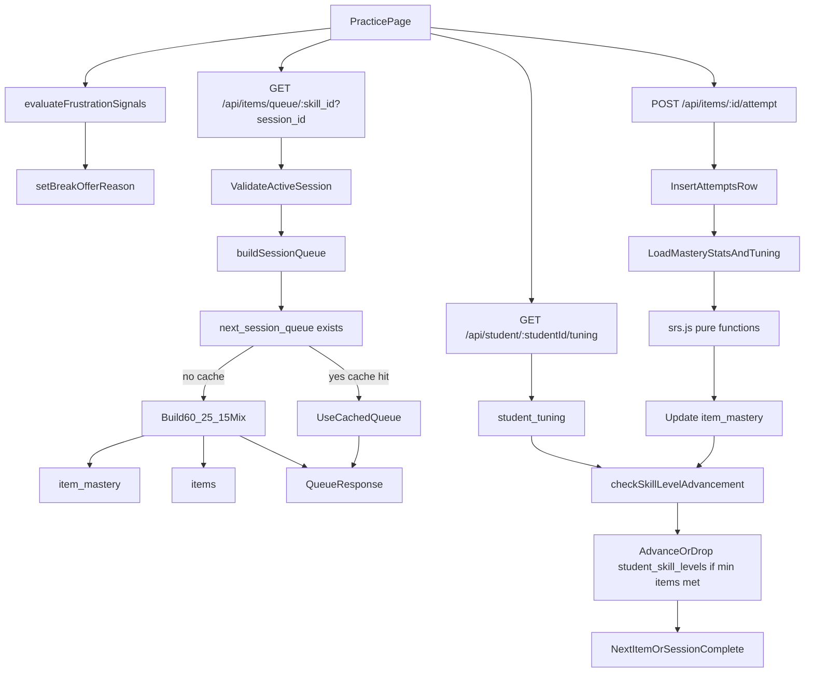
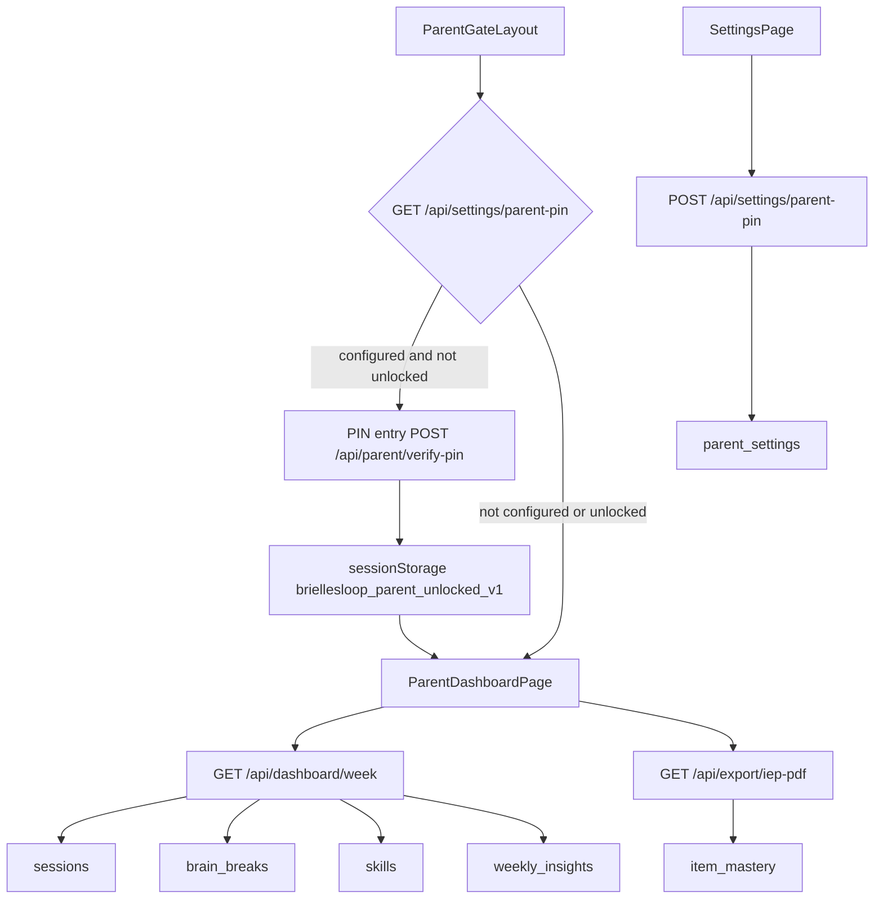

# Data Flow Diagram

```mermaid
flowchart TD
  frontendApp[frontendApp localhost:5173] --> backendApi[backendApi localhost:3001]
  backendApi --> sessionApi[/api/session/*]
  backendApi --> itemsApi[/api/items/*]
  backendApi --> aiApi[/api/ai/*]
  backendApi --> ttsApi[/api/tts]
  backendApi --> dashboardApi[/api/dashboard/*]
  backendApi --> agentsApi[/api/agents/*]
  backendApi --> exportApi[/api/export/iep-pdf]
  backendApi --> settingsApi[/api/settings/*]
  backendApi --> parentApi[/api/parent/*]
  backendApi --> shareApi[/api/share/*]
  backendApi --> iepApi[/api/iep/*]

  iepApi --> iepDocumentsTbl[iep_documents]
  studentsTbl[students] --> iepDocumentsTbl
  settingsPageIep[SettingsPage_IEP_upload] --> iepApi
  frontendApp --> settingsPageIep

  shareApi --> shareTokensTbl[share_tokens]
  shareTokensTbl --> studentsTbl
  settingsPageShare[SettingsShareTokens] --> shareApi
  teacherSharePage[TeacherDashboardShareRoute] --> shareApi
  frontendApp --> teacherSharePage
  frontendApp --> settingsPageShare

  parentDashboard[ParentDashboard] --> studentsTbl
  parentDashboard --> parentSettingsTbl[parent_settings]
  settingsApi --> parentSettingsTbl
  parentApi --> parentSettingsTbl
  parentDashboard --> sessionsTbl[sessions]
  sessionsTbl --> attemptsTbl[attempts]
  sessionsTbl --> brainBreaksTbl[brain_breaks]
  studentsTbl --> studentSkillLevelsTbl[student_skill_levels]
  studentsTbl --> itemMasteryTbl[item_mastery]
  skillsTbl[skills] --> itemsTbl[items]
  skillsTbl --> sessionsTbl
  itemsTbl --> itemMasteryTbl
  itemsTbl --> attemptsTbl
  studentsTbl --> weeklyInsightsTbl[weekly_insights]

  cronScheduler[nodeCronSchedule] --> agentsApi
  cronScheduler --> agentRunners[agentConversationRunner]
  agentRunners --> anthropicApi[AnthropicMessagesAPI]
  anthropicApi --> agentRunsTbl[agent_runs]
  agentsTbl[agents] --> agentRunsTbl
  agentRunsTbl --> agentActionsTbl[agent_actions]
  studentsTbl --> studentTuningTbl[student_tuning]
  agentsTbl --> studentTuningTbl
  agentActionsTbl --> studentTuningTbl
  agentActionsTbl --> sessionsTbl
  agentActionsTbl --> studentSkillLevelsTbl
  agentActionsTbl --> queueCacheTbl[next_session_queue]
  agentActionsTbl --> weeklyInsightsTbl[weekly_insights]
  agentActionsTbl --> iepConcernTbl[iep_concern_flags]
  agentActionsTbl --> skillsTbl
  agentRunners --> iepDocumentsTbl
  itemsApi --> queueCacheTbl
  sessionApi --> sessionsTbl
  itemsApi --> itemsTbl
  itemsApi --> attemptsTbl
  practicePage --> ttsApi
  dashboardApi --> weeklyInsightsTbl
  dashboardApi --> sessionsTbl
  dashboardApi --> brainBreaksTbl
  shareApi --> sessionsTbl
  shareApi --> attemptsTbl
  shareApi --> weeklyInsightsTbl
  exportApi --> sessionsTbl
  exportApi --> weeklyInsightsTbl
  exportApi --> itemMasteryTbl
  agentsApi --> agentsTbl
  agentsApi --> agentRunsTbl
  agentsApi --> agentActionsTbl
  agentsApi --> agentNotesTbl[agent_notes]
  agentRunners --> agentNotesTbl
  promptFiles[prompts_md_on_disk] --> agentRunners
  agentsApi --> promptFiles
```

## Notes

- **Jiu Jitsu (academic knowledge):** The `jiujitsu` skill appears in `skills` with seeded `jiujitsu_quiz` rows in `items`. The Today page, `/api/dashboard/skills`, session start, and `/api/items/queue/:skill` follow the same path as reading/math. Grading uses deterministic `gradeJiujitsuLocal` in `backend/src/services/grader.js`. Optional hints for jiujitsu items use `/api/ai/hint` with `generateJiujitsuHint` (see `backend/src/prompts/jiujitsu-hint.md`).
- Core learning flow: `students` + `skills` drive session queueing, attempts, and item mastery updates.
- Agent flow: **node-cron** (when `AGENT_SYSTEM_ENABLED` is not `false`) schedules runs per `agents.schedule_cron` and `agents.enabled`. Each run calls **Anthropic Messages** with tool-use; results go to `agent_runs` / `agent_actions`. Writes target `student_tuning`, `next_session_queue`, `weekly_insights`, and `iep_concern_flags`. The **curriculum** agent (`0 6 * * 3`) reads `iep_documents` via tools and proposes `iep_goal_update` / `level_override` actions; **parent approval** applies updates to `skills.iep_goal_text` and `student_skill_levels`. Parent UI (`/parent`, `/parent/agents`) and `PATCH /api/agents/:name/enabled` control visibility and scheduling.
- **Simulation & notes (FR-49+):** `POST /api/agents/:name/simulate` runs the same agent with `dry_run=true` on `agent_runs` (`status` → `simulation`): read tools query Postgres with a fixed UTC date window from the request; listed write tools return mocked `{ success, id, dry_run }` and **no** `agent_actions` rows. `GET /api/agents/notes` lists `agent_notes`; agents may call `read_agent_notes` / `write_agent_note` tools (writes go to `agent_notes`). Prompts load from `backend/src/agents/prompts/*.md`; `GET/PUT /api/agents/:name/prompt` and `PUT .../prompt/restore` (.bak single-level) support the Agent Activity prompt editor.
- Weekly summaries are persisted in `weekly_insights` for parent review and IEP reporting.
- API layer now includes SRS-driven queue building and mastery updates in `/api/items/*`.
- **Parent PIN:** `parent_settings.parent_pin_hash` (bcrypt). `GET /api/settings/parent-pin`, `POST /api/settings/parent-pin`. Unlock: `POST /api/parent/verify-pin`. Frontend keeps an unlocked flag in `sessionStorage` for `/parent/*`.
- **Teacher / IEP share (FR-38–FR-40):** `share_tokens` stores opaque 64-hex tokens with `expires_at` and optional `revoked_at`. Settings calls `POST /api/share/token`, `GET /api/share/tokens`, `DELETE /api/share/token/:id`. The `/share/:token` route (outside `Layout` and outside the parent PIN gate) calls `GET /api/share/validate/:token` then `GET /api/share/week/:token` for a sanitized week payload (no `student_id`, no `agent_activity`) plus `fluency_series` from reading attempts. `FRONTEND_ORIGIN` in the backend env builds the printable URL in `POST` responses when needed.
- **Phase 6 learner profile & onboarding:** `GET/PATCH /api/settings/profile` reads/writes `students.interests`, `skills.iep_goal_text`, `student_skill_levels.level`, `student_tuning.session_item_count`, and `parent_settings` voice fields (`voice_math_enabled`, `voice_spelling_enabled`, `tts_voice`). `POST /api/settings/onboarding/complete` sets `parent_settings.onboarding_completed_at`. The `/onboarding` route (outside `Layout`) collects interests, PIN, and session length before redirecting to `/`. Layout redirects incomplete onboarding to `/onboarding` except for `/settings`.
- **Kokoro TTS:** `GET /api/tts` (WAV) and `GET /api/tts/voices` serve local Kokoro synthesis for spelling practice, **Coach Says** read-back after each graded attempt on `PracticePage` (uses `parent_settings.tts_voice`), and settings voice preview lists. Practice fetches audio blobs from the Express server (not `speechSynthesis`). Reading practice is text-only (no passage TTS in the reading skill view).
- **Monthly API spend:** `GET /api/agents/cost-summary` sums `agent_runs.cost_usd` and `ai_generations.cost_usd` for a calendar month (optional `?month=YYYY-MM`). Rendered on `/parent/agents`.
- **Parent dashboard data:** `GET /api/dashboard/week` aggregates `sessions`, `brain_breaks`, `skills`, `weekly_insights` (UTC Monday week windows).
- **FR-16 skill drop:** On each graded attempt, `/api/items/:id/attempt` computes **UTC calendar week** accuracy per skill; if below `weekly_drop_accuracy` (tuning) with enough attempts, applies **at most one** level decrease per skill per week, updates `student_skill_levels.last_weekly_drop_week_start`, and bumps `item_mastery.next_review_at` for recent misses (14 days).
- **Writing flow (FR-30..FR-33):** writing uses seeded `writing_prompt` templates, Claude-rendered one-item sessions, rubric grading (`>=70` counts correct), and Tier-3->4 ignores response-time gate.
- **Practice frustration (FR-5):** `GET /api/session/:id/frustration-context`, `GET /api/student/:studentId/tuning`, and `POST /api/session/:id/frustration-eval` feed `PracticePage` static thresholds plus additive `frustration_signal:*` checks (`evaluateFrustrationSignals`) before brain-break offers.
- **IEP PDF:** `POST /api/iep/upload` (multer + `pdf-parse` v2 `PDFParse`) stores files under `backend/data/iep/` and plain text in `iep_documents`; `GET /api/iep/document` returns the active row preview for Settings. `GET /api/export/iep-pdf` builds an A4 `pdf-lib` report (12-week tables + snapshots).

## Frontend Route Shell (Design System Foundation)



## Today Page Flow (Mood + Skill Start)

```mermaid
flowchart TD
  todayPage[TodayPage] --> moodCheckIn[MoodCheckIn]
  todayPage --> skillPicker[SkillTileGrid]
  todayPage --> planCard[TodayPlanCard]

  todayPage --> dashboardSkillsApi[GET /api/dashboard/skills]
  topNav[TopNav] --> dashboardSkillsApi
  dashboardSkillsApi --> skillsTbl[skills]
  dashboardSkillsApi --> studentSkillLevelsTbl[student_skill_levels]
  dashboardSkillsApi --> itemMasteryTbl[item_mastery]
  dashboardSkillsApi --> suggestedSkillSvc[getSuggestedSkill]
  dashboardSkillsApi --> practiceStreakSvc[computePracticeStreakDays]
  practiceStreakSvc --> sessionsEndedUtc[sessions ended_at UTC]

  planCard --> sessionStartApi[POST /api/session/start]
  sessionStartApi --> sessionsTbl[sessions]
  sessionStartApi --> skillsLookup[skills]

  todayPage --> moodDecision{lowMoodOrLowScore}
  moodDecision -->|yes| breakRoute[/break]
  moodDecision -->|no| practiceRoute[/practice/:skillName]
```

## SRS Queue + Attempt Flow



## Math Activity Loop (Claude generation + grading + hint)

```mermaid
flowchart TD
  practicePage[PracticePage math] --> queueApi[GET /api/items/queue/math?session_id]
  queueApi --> ensureItems[ensureMathQueueItems]
  ensureItems --> contentGenerator[content-generator.generateMathItem]
  contentGenerator --> claudeApi[Claude messages API]
  contentGenerator --> aiGenerationsTbl[ai_generations cache]
  contentGenerator --> itemsTbl[items]
  contentGenerator --> itemMasteryTbl[item_mastery tier 0]
  queueApi --> queueBuilderMath[buildSessionQueue 60/25/15]
  queueBuilderMath --> queueResponseMath[QueueResponse]

  practicePage --> attemptApiMath[POST /api/items/:id/attempt]
  attemptApiMath --> graderSvc[grader.gradeAttempt]
  graderSvc --> claudeApi
  graderSvc --> aiGenerationsTbl
  attemptApiMath --> attemptsTbl[attempts ai_feedback]
  attemptApiMath --> itemMasteryTbl
  attemptApiMath --> studentSkillLevelsTbl[student_skill_levels]
  attemptApiMath --> attemptResp[NextItem or sessionComplete + tier_changed]

  practicePage --> hintApi[POST /api/ai/hint]
  hintApi --> hintSvc[grader.generateHint]
  hintSvc --> claudeApi
  hintSvc --> aiGenerationsTbl
  hintApi --> coachCard[CoachCard hint]

  practicePage --> completeRoute[/practice/math/complete]
  completeRoute --> sessionEndApi[POST /api/session/:id/end]
  sessionEndApi --> sessionsEndedAt[sessions ended_at + items_attempted/correct]
```

## Reading, Spelling, Typing, and Writing

```mermaid
flowchart TD
  practicePage[PracticePage dispatch] --> skillViews[MathReadingSpellingTypingWriting views]

  queueRead[GET queue reading] --> ensureRead[ensureReadingQueueItems]
  ensureRead --> classicRead[reading-classic-excerpts pickClassicReadingExcerpt]
  classicRead --> itemsRead[items reading_passage book_attribution metadata]

  queueSpell[GET queue spelling] --> ensureSpell[ensureSpellingQueueItems]
  ensureSpell --> spellBank[items spelling_word seeded bank]

  queueType[GET queue typing] --> ensureType[ensureTypingQueueItems]
  ensureType --> genType[skills-queue.generateTypingItem]
  genType --> claudeType[Claude]
  genType --> itemsType[items typing_sentence]

  attemptRead[POST attempt reading] --> gradeRead[grader Claude reading_grade]
  attemptRead --> attemptsTbl
  attemptRead --> sessionTargetRead["sessionComplete when attempts >= session_item_count * 3"]

  attemptSpell[POST attempt spelling] --> gradeSpell[grader local string match]
  attemptType[POST attempt typing] --> gradeType[grader local accuracy + WPM]
  queueWrite[GET queue writing] --> ensureWrite[ensureWritingQueueItems]
  ensureWrite --> templateSeed[items writing_prompt templates]
  ensureWrite --> renderWrite[content-generator generateWritingRendition]
  renderWrite --> claudeWrite[Claude writing-generator]
  renderWrite --> itemsWrite[items writing_prompt rendered]
  attemptWrite[POST attempt writing] --> gradeWrite[grader Claude writing_grade]
  gradeWrite --> rubricOut[criteria conventions sentence_variety main_idea detail]

  hintRead[POST /api/ai/hint reading] --> hintReadSvc[generateReadingHint Claude]
  hintSpell[spelling Hear again] --> kokoroTts[GET /api/tts Kokoro WAV]
```



- **Practice UI**: [`PracticePage.jsx`](frontend/src/pages/PracticePage.jsx) delegates rendering to [`PracticeSkillViews.jsx`](frontend/src/components/practice/PracticeSkillViews.jsx) per skill; spelling shows the target word on screen, then **Hear again** fetches Kokoro audio from `GET /api/tts`; typing shows live WPM/accuracy vs target.
- **Reading**: New queue shortfall is filled from curated **public-domain book excerpts** (`reading-classic-excerpts.js`) with `book_attribution` in metadata instead of Claude-generated passages. Each queued row still has three comprehension questions; the client sends `reading_question_index` (0–2) per attempt; session completion counts attempts at **3×** `session_item_count` so five passages still equal fifteen graded interactions.

## CBT Break + Post-Session Checkout Flow

```mermaid
flowchart TD
  todayPage[TodayPage] --> moodCheck[MoodCheckIn pre_mood]
  moodCheck --> lowMoodGate{score_lte_3_or_sad_worried}
  lowMoodGate -->|yes| breakRouteLow[/break triggered_by low_mood]
  lowMoodGate -->|no| practicePage[PracticePage]

  practicePage --> frustrationGate{two_wrong_or_slow_item_or_user_button}
  frustrationGate -->|offer_accept| breakRouteInSession[/break triggered_by auto_or_user]
  frustrationGate -->|decline| practicePage

  breakRouteLow --> breakLogApi[POST /api/session/:id/brain-break]
  breakRouteInSession --> breakLogApi
  breakLogApi --> brainBreaksTbl[brain_breaks]

  practicePage --> completePage[SessionCompletePage]
  completePage --> endApi[POST /api/session/:id/end]
  endApi --> sessionsTbl[sessions ended_at]
  completePage --> postCheckoutApi[POST /api/session/:id/post-checkout]
  postCheckoutApi --> sessionsMood[sessions post_mood_emoji post_mood_score reflection]
```

## Parent dashboard + PIN + IEP export


